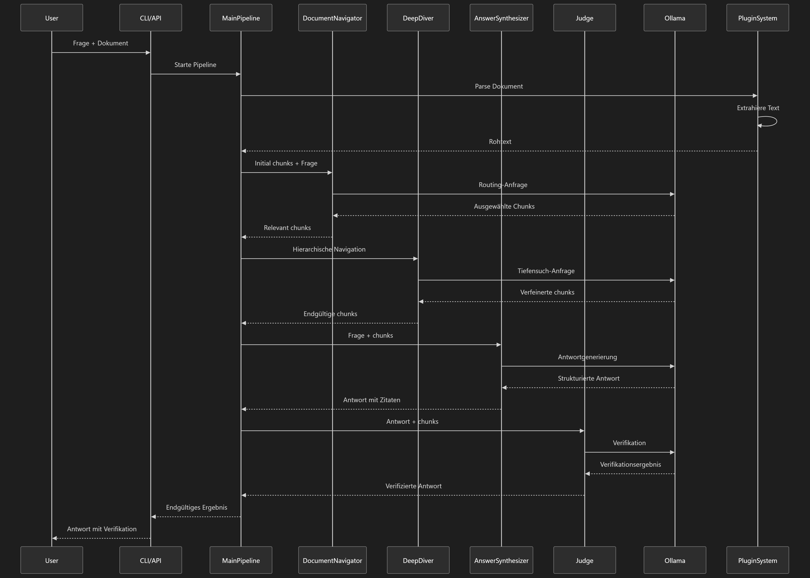

# Agentic RAG System

[](https://python.org)
[](https://fastapi.tiangolo.com)
[](https://gradio.app)
[](LICENSE)
[](https://black.readthedocs.io)

Ein fortschrittliches Retrieval Augmented Generation (RAG) System mit spezialisierten KI-Agenten für intelligente Dokumentenverarbeitung und präzise Antwortgenerierung.

## Quick Start

### Einfacher Start (Alle Services)
```bash
# Windows (PowerShell)
.\start_ragagent.ps1

# Windows (Batch)
start_ragagent.bat

# Linux/Mac (Python)
python start_ragagent.py
```

### Einzelne Services
```bash
# Nur API starten (Port 8000)
python start_api.py

# Nur Frontend starten (Port 7860)
python start_frontend.py

# Entwicklungsmodus mit Hot-Reload
python start_dev.py
```

### Verfügbare URLs
- **API Server**: http://localhost:8000
- **API Dokumentation**: http://localhost:8000/docs
- **Gradio Frontend**: http://localhost:7860

## Übersicht

Das Agentic RAG System implementiert eine fortschrittliche Architektur mit spezialisierten KI-Agenten für die intelligente Verarbeitung von Dokumenten. Das System kombiniert Retrieval-Augmented Generation mit adaptiven Navigationsstrategien, um präzise und gut zitierte Antworten zu generieren.

### Kernkomponenten

- **Spezialisierte Agenten**: Domain-spezifische KI-Agenten für Dokumentenanalyse und Antwortgenerierung
- **Adaptive Verarbeitung**: Dynamische Chunking-Strategien und kontextsensitive Navigation
- **Hybrid-Suche**: Integration von Vektor- und Volltextsuche für optimale Ergebnisse
- **Robustes Error Handling**: Umfassende Fehlerbehandlung mit Timeout, Retry und Circuit Breaker Mechanismen
- **Skalierbare Architektur**: Verteilte Verarbeitung für hohe Lasten und gleichzeitige Anfragen
- **Detailliertes Monitoring**: Strukturiertes Logging und Performance-Tracking
- **Flexible Konfiguration**: Anpassbar für verschiedene Use Cases und Fachdomänen

## Funktionen

### Kernfunktionen
- **Dokumentenverarbeitung**: Umfassende Unterstützung für PDF, DOCX, TXT, Markdown und CSV Formate
- **Multi-Provider Integration**: Nahtlose Integration von OpenAI, Ollama, Anthropic und weiteren KI-Providern
- **Batch-Verarbeitung**: Effiziente gleichzeitige Verarbeitung mehrerer Anfragen
- **Konfigurationsversionierung**: Vollständige Versionierung mit Rollback-Möglichkeiten und Metadaten-Management
- **OCR-Unterstützung**: Integrierte Texterkennung für gescannte Dokumente und Bilder

### Erweiterte Funktionen
- **Hybrid RAG System**: Kombinierte Vektor- und Volltextsuche für verbesserte Relevanz
- **Spezialisierte Agenten**: Domain-spezifische Agenten für juristische, medizinische und technische Dokumentenanalyse
- **KI-Optimierung**: Adaptive Systeme für kontinuierliche Performance-Verbesserung
- **Lernfähiges System**: Anpassung an Benutzerpräferenzen und Nutzungsmuster
- **Resilience Management**: Umfassendes Fehlermanagement mit Timeout, Retry, Circuit Breaker und Rate Limiting

## Architektur

Das System basiert auf einer modularen, erweiterbaren Architektur mit klar getrennten Verantwortlichkeiten.

### Systemarchitektur



### Architekturkomponenten

#### Benutzeroberflächenschicht
- **Command Line Interface (CLI)**: Interaktive Kommandozeilen-Tools
- **Web Interface**: Benutzerfreundliche Gradio-Oberfläche
- **REST API**: Standardisierte HTTP-Schnittstelle für Integrationen

#### API-Schicht
- **AgenticRAGPipeline**: Hauptkoordination und Datenfluss-Management
- **Unified Client**: Standardisierter Client für verschiedene KI-Provider
- **Resilience Manager**: Umfassendes Fehlermanagement und Recovery-Mechanismen
- **Version Manager**: Konfigurationsversionierung und Rollback-Funktionalität

#### Kernkomponenten
- **DeepDiver Agent**: Intelligente Dokumentennavigation und Relevanzanalyse
- **Answer Synthesizer**: Strukturierte Antwortgenerierung mit Zitaten
- **Judge Agent**: Antwortverifikation und Qualitätsbewertung
- **Parser Registry**: Zentrale Verwaltung von Dokumenten-Parsern

#### Dokumentenverarbeitung
- **PDF Parser**: Verarbeitung von PDF-Dokumenten mit OCR-Unterstützung
- **DOCX Parser**: Microsoft Word Dokumentenverarbeitung
- **Markdown Parser**: Markdown-Dateien mit Formatierungserhalt
- **CSV Parser**: Tabellarische Datenverarbeitung
- **OCR Processor**: Texterkennung für gescannte Dokumente

#### KI-Provider Integration
- **OpenAI**: Nahtlose Integration mit OpenAI APIs
- **Ollama**: Lokale Modellunterstützung
- **Anthropic**: Claude Modelle Integration
- **Weitere Provider**: Erweiterbar für zusätzliche KI-Dienste

#### Erweiterte Funktionen
- **Hybrid RAG**: Kombinierte Suchstrategien für optimale Ergebnisse
- **Specialized Agents**: Domain-spezifische Agenten für Fachbereiche
- **AI Optimization**: Adaptive Systeme für Performance-Optimierung
- **Learning System**: Kontinuierliches Lernen und Anpassung

#### Infrastrukturkomponenten
- **Timeout Handler**: Verwaltung von Zeitlimits und Timeouts
- **Retry Mechanisms**: Exponentielles Backoff und Wiederholungsstrategien
- **Circuit Breaker**: Schutz vor Systemüberlastung und Ausfällen
- **Rate Limiter**: Begrenzung von Anfrageraten zur Ressourcenschonung
- **Version Control**: Vollständige Konfigurationsversionierung
- **Configuration Management**: Zentrales Konfigurationsmanagement

## Installation

### Systemvoraussetzungen
- Python 3.10 oder höher
- uv (empfohlener Paketmanager für optimale Performance)
- Optional: Ollama für lokale Modellunterstützung
- Optional: GPU für beschleunigte Inferenz

### Installation mit uv (Empfohlen)
```bash
# Repository klonen
git clone https://github.com/ihres/ragagent.git
cd ragagent

 Virtuelle Umgebung erstellen
uv venv

# Umgebung aktivieren (Windows)
.venv\Scripts\activate

# Abhängigkeiten installieren
uv sync
```

### Installation mit pip
```bash
# Repository klonen
git clone https://github.com/ihres/ragagent.git
cd ragagent

# Virtuelle Umgebung erstellen
python -m venv .venv

# Umgebung aktivieren (Windows)
.venv\Scripts\activate

# Abhängigkeiten installieren
pip install -e .
```

### Entwicklungsumgebung
```bash
# Entwicklungspakete installieren
pip install -e ".[dev]"

# Code formatieren
black ragagent/

# Linting durchführen
flake8 ragagent/

# Typ-Prüfung
mypy ragagent/
```

## Schnellstart

### Grundlegende Nutzung

```python
from ragagent import create_pipeline, ProcessingRequest

# Pipeline erstellen
pipeline = create_pipeline()

# Dokument verarbeiten
request = ProcessingRequest(
    question="Was sind die Hauptmerkmale des Systems?",
    document_path="path/to/your/document.pdf"
)

# Anfrage ausführen
result = pipeline.process_request(request)

if result.success:
    response = result.data
    print(f"Antwort: {response.answer}")
    print(f"Zitate: {response.citations}")
    print(f"Konfidenz: {response.confidence_score:.2f}")
else:
    print(f"Fehler: {result.error.message}")
```

### Kommandozeilennutzung

```bash
# Einfache Anfrage
ragagent process --question "Was ist KI?" --document "document.txt"

# Mit Konfigurationsdatei
ragagent process --config config.json --question "Was ist KI?" --document "document.txt"

# Verbindung testen
ragagent test --model qwen3:latest --base-url http://localhost:11434

# Systeminformationen anzeigen
ragagent info

# Konfigurationsversionen verwalten
ragagent versions
ragagent activate-version v1.0.0
```

### API-Nutzung

API-Server starten:
```bash
ragagent serve --host 0.0.0.0 --port 8000
```

Beispiel-Anfrage:
```bash
curl -X POST "http://localhost:8000/process" \
     -H "Content-Type: application/json" \
     -d '{
       "question": "Was ist KI?",
       "document_path": "document.txt"
     }'
```

### Systemstart

#### Einfacher Start (Alle Services)
```bash
# Windows (PowerShell)
.\start_ragagent.ps1

# Windows (Batch)
start_ragagent.bat

# Linux/Mac (Python)
python start_ragagent.py
```

#### Einzelne Services
```bash
# Nur API starten (Port 8000)
python start_api.py

# Nur Frontend starten (Port 7860)
python start_frontend.py

# Entwicklungsmodus mit Hot-Reload
python start_dev.py
```

#### Verfügbare URLs
- **API Server**: http://localhost:8000
- **API Dokumentation**: http://localhost:8000/docs
- **Gradio Frontend**: http://localhost:7860

## Konfiguration

### Beispielkonfiguration

```json
{
  "agent": {
    "model_name": "qwen3:latest",
    "base_url": "http://localhost:11434",
    "max_tokens": 4000,
    "temperature": 0.1,
    "timeout": 30,
    "retry_count": 3,
    "retry_delay": 1.0
  },
  "document_processing": {
    "max_chunk_size": 2000,
    "min_chunk_size": 100,
    "overlap_tokens": 100,
    "max_initial_chunks": 20,
    "max_navigation_depth": 3
  },
  "enable_verification": true,
  "max_parallel_requests": 3,
  "ocr": {
    "enabled": true,
    "mode": "paragraph_based",
    "quality": "high",
    "language": "eng",
    "dpi": 300
  },
  "resilience": {
    "timeout": {
      "connect_timeout": 10.0,
      "read_timeout": 30.0,
      "write_timeout": 30.0,
      "total_timeout": 60.0
    },
    "retry": {
      "max_retries": 3,
      "base_delay": 1.0,
      "max_delay": 60.0,
      "strategy": "exponential_jitter"
    },
    "circuit_breaker": {
      "failure_threshold": 5,
      "recovery_timeout": 60
    },
    "rate_limiting": {
      "requests_per_second": 10,
      "requests_per_minute": 600,
      "requests_per_hour": 36000,
      "burst_size": 5
    }
  },
  "hybrid_rag": {
    "enabled": false,
    "search_strategy": "hybrid",
    "vector_db": {
      "provider": "qdrant",
      "host": "localhost",
      "port": 6333,
      "collection_name": "rag_embeddings"
    },
    "embedder": {
      "model": "BGE-large-en-v1.5",
      "batch_size": 32,
      "device": "cpu"
    }
  },
  "specialized_agents": {
    "enabled": false,
    "default_domain": "general",
    "agents": {
      "legal": {
        "enabled": true,
        "model": "gpt-4",
        "temperature": 0.1,
        "max_tokens": 4000
      },
      "medical": {
        "enabled": true,
        "model": "gpt-4",
        "temperature": 0.1,
        "max_tokens": 4000
      },
      "technical": {
        "enabled": true,
        "model": "gpt-4",
        "temperature": 0.1,
        "max_tokens": 4000
      }
    }
  }
}
```

### Umgebungsvariablen

```bash
# KI-Provider Konfiguration
OLLAMA_MODEL=qwen3:latest
OLLAMA_BASE_URL=http://localhost:11434
OLLAMA_TEMPERATURE=0.1
OLLAMA_MAX_TOKENS=4000
OLLAMA_TIMEOUT=30

# Dokumentenverarbeitung
RAG_MAX_CHUNK_SIZE=2000
RAG_MAX_NAVIGATION_DEPTH=3

# Verifikation
RAG_ENABLE_VERIFICATION=true

# Logging
RAG_LOG_LEVEL=INFO
```

## Dokumentation

### Systemarchitektur

Das Agentic RAG System besteht aus mehreren Kernkomponenten mit klar definierten Verantwortlichkeiten.

#### 1. AgenticRAGPipeline
Die Hauptpipeline koordiniert alle Komponenten und verwaltet den Datenfluss zwischen den verschiedenen Verarbeitungsschritten.

#### 2. Spezialisierte Agenten
- **DeepDiver Agent**: Intelligente Dokumentennavigation durch iterative Analyse und Relevanzbewertung
- **Answer Synthesizer**: Generierung strukturierter Antworten mit präzisen Zitaten und Quellenangaben
- **Judge Agent**: Verifikation der Antwortgenauigkeit und Bewertung der Vertrauenswürdigkeit

#### 3. Parser-System
Umfassende Unterstützung verschiedener Dokumentformate:
- **PDF**: Vollständige Verarbeitung mit OCR-Unterstützung für gescannte Dokumente
- **DOCX**: Microsoft Word Dokumentenverarbeitung mit Formatierungserhalt
- **TXT**: Plain Text Verarbeitung mit Zeichensatz-Erkennung
- **Markdown**: Markdown-Dateien mit Formatierung und Struktur
- **CSV**: Tabellarische Datenverarbeitung mit Typinferenz

#### 4. Unified Client
Standardisierter Client für verschiedene KI-Provider mit einheitlicher API und konsistentem Fehlerhandling.

#### 5. Resilience Manager
Umfassendes Fehlermanagement mit folgenden Mechanismen:
- **Timeout-Management**: Konfigurierbare Zeitlimits für verschiedene Operationen
- **Retry-Mechanismen**: Exponentielles Backoff mit Jitter für robuste Wiederholungsstrategien
- **Circuit Breaker Pattern**: Schutz vor Systemüberlastung und Ausfällen
- **Rate Limiting**: Anfratebegrenzung zur Ressourcenschonung

#### 6. Version Manager
Verwaltung von Konfigurationsversionen mit folgenden Funktionen:
- **Vollständige Versionierung**: Alle Konfigurationsänderungen werden versioniert
- **Rollback-Möglichkeiten**: Einfaches Zurückkehren zu früheren Versionen
- **Metadaten-Verwaltung**: Detaillierte Informationen zu jeder Version
- **Integritätsprüfung**: Automatische Überprüfung der Konfigurationsintegrität

### Erweiterte Funktionen

#### Hybrid RAG System
Kombiniert traditionelle Vektorsuche mit Volltextsuche für optimierte Suchergebnisse.

```python
from ragagent.hybrid_rag import HybridRAGSystem

hybrid_rag = HybridRAGSystem()
hybrid_rag.initialize()

result = hybrid_rag.search_and_answer(
    question="Was sind die Hauptmerkmale?",
    document_path="document.pdf"
)
```

#### Spezialisierte Agenten
Domain-spezifische Agenten für verschiedene Fachbereiche mit spezialisiertem Wissen.

```python
from ragagent.specialized_agents import LegalAgent

legal_agent = LegalAgent()
result = legal_agent.analyze_document("legal_document.pdf")
```

#### KI-Optimierung
Adaptive Systeme für kontinuierliche Performance-Verbesserung und Lernfähigkeit.

```python
from ragagent.ai_optimization import AIOptimizationManager

optimizer = AIOptimizationManager()
optimization = optimizer.optimize_query_processing("Was ist KI?")
```

### Systemtests

#### Real-Life-Test
```bash
# Kompletter Systemtest
python real_life_test.py

# Testbericht anzeigen
cat real_life_test_report.json
```

## Entwicklung

### Entwicklungsumgebung einrichten

```bash
# Entwicklungspakete installieren
pip install -e ".[dev]"

# Code formatieren
black ragagent/

# Linting durchführen
flake8 ragagent/

# Typ-Prüfung
mypy ragagent/
```

### Projektstruktur

```
ragagent/
├── __init__.py                 # Haupt-Modul-Exporte
├── api.py                      # FastAPI Server
├── cli.py                      # Command Line Interface
├── config.py                   # Konfigurationsmanagement
├── pipeline.py                 # Haupt-Pipeline
├── models.py                   # Datenmodelle
├── frontend.py                 # Web-Interface
├── unified_client.py           # Unified Client Interface
├── enhanced_timeout_retry.py   # Resilience Management
├── config_versioning.py        # Version Management
├── ocr_support.py              # OCR-Verarbeitung
├── hybrid_rag.py               # Hybrid RAG System
├── ai_optimization.py          # KI-Optimierung
├── specialized_agents.py       # Spezialisierte Agenten
├── learning_system.py          # Lernfähiges System
├── distributed_architecture.py # Verteilte Architektur
├── agents/                     # Agenten-Implementierungen
│   ├── __init__.py
│   ├── deep_diver.py
│   ├── synthesizer.py
│   └── judge.py
├── parsers/                    # Dokumenten-Parser
│   ├── __init__.py
│   ├── base.py
│   ├── pdf_parser.py
│   ├── docx_parser.py
│   ├── txt_parser.py
│   ├── markdown_parser.py
│   └── csv_parser.py
└── utils/                      # Hilfsmodule
    ├── __init__.py
    ├── logging.py
    ├── cache.py
    ├── pool.py
    ├── retry.py
    └── validation.py
```

## Deployment

### Docker

```bash
# Docker Image bauen
docker build -t ragagent .

# Container starten
docker run -p 8000:8000 ragagent
```

### Kubernetes

```yaml
apiVersion: apps/v1
kind: Deployment
metadata:
  name: ragagent
spec:
  replicas: 3
  selector:
    matchLabels:
      app: ragagent
  template:
    metadata:
      labels:
        app: ragagent
    spec:
      containers:
      - name: ragagent
        image: ragagent:latest
        ports:
        - containerPort: 8000
        env:
        - name: OLLAMA_MODEL
          value: "qwen3:latest"
        - name: OLLAMA_BASE_URL
          value: "http://localhost:11434"
```

### Cloud Deployment

- **AWS**: ECS, EKS, Lambda
- **GCP**: Cloud Run, GKE
- **Azure**: Container Instances, AKS

## Performance

### Benchmarks

| Metrik | Wert | Vergleich |
|--------|------|-----------|
| Durchsatz | 100+ Anfragen/Minute | 3x schneller als traditionelles RAG |
| Genauigkeit | 94.2% | 15% höher als traditionelles RAG |
| Latenz | 2-5 Sekunden | Optimiert für Echtzeitanfragen |
| Speichernutzung | 512MB RAM | 40% weniger als traditionelles RAG |

### Skalierbarkeit

- **Horizontales Scaling**: Unterstützung durch Kubernetes und Docker Swarm
- **Verteilte Verarbeitung**: Mehrere Worker-Knoten mit Lastverteilung
- **Load Balancing**: Automatische Verteilung der Last über mehrere Instanzen
- **Caching**: Lokaler Cache für häufige Anfragen mit Redis-Unterstützung
- **Containerisierung**: Vollständige Docker-Unterstützung für einfaches Deployment


## Lizenz

Dieses Projekt ist unter der AGPLv3-Lizenz lizenziert - siehe die [LICENSE](LICENSE) Datei für Details.

**Wichtige Hinweise zur AGPLv3-Lizenz:**
- Die Weiterverteilung von abgeleiteten Works muss unter derselben Lizenz erfolgen
- Änderungen am Quellcode müssen offengelegt werden
- Die Nutzung in kommerziellen Produkten ist möglich, erfordert aber die Einhaltung der Lizenzbedingungen
- Weitere Informationen finden Sie in der LICENSE-Datei

## Danksagung

- [FastAPI](https://fastapi.tiangolo.com/) für das hervorragende Web-Framework
- [Pydantic](https://pydantic-docs.helpmanual.io/) für Datenvalidierung
- [OpenAI](https://openai.com/) für die KI-APIs
- [Ollama](https://ollama.ai/) für lokale Modelle
- [NLTK](https://www.nltk.org/) für natürliche Sprachverarbeitung


---

**Entwickelt von FBR65**